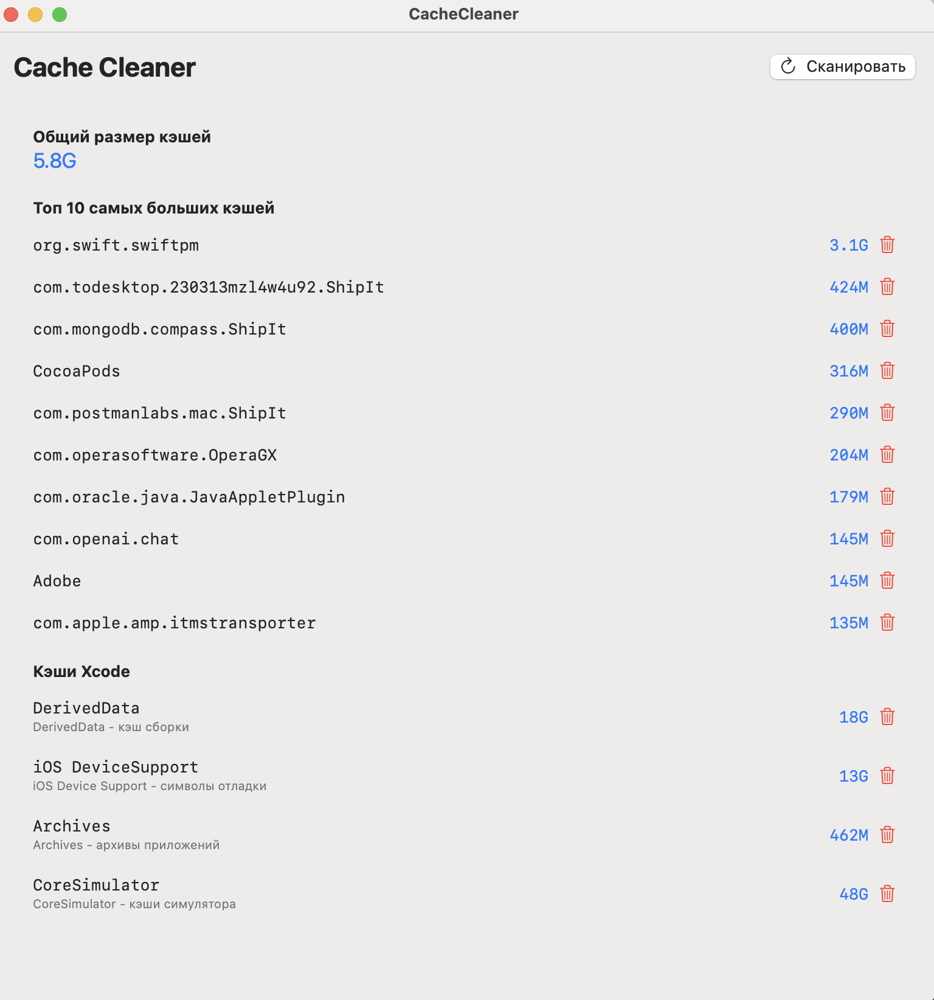

# CacheCleaner for macOS

A powerful and user-friendly application for managing cache files on macOS. This tool helps you monitor and clean various types of caches to free up disk space.



## Features

- 📊 Display total cache size
- 📋 Show top 10 largest cache directories
- 🔍 Detailed Xcode cache information:
  - DerivedData
  - iOS Device Support
  - Archives
  - CoreSimulator
- 🗑️ One-click cache cleaning
- 🔄 Real-time size updates
- 👀 Clear and intuitive interface

## System Requirements

- macOS 14.0 or later
- Xcode 15.0 or later (for building)

## Installation

### Binary Release
Download the latest version from the [Releases](https://github.com/yourusername/CacheCleaner/releases) page and move the application to your Applications folder.

### From Source
1. Clone the repository:
```bash
git clone https://github.com/yourusername/CacheCleaner.git
```
2. Open the project in Xcode:
```bash
cd CacheCleaner
open CacheCleaner.xcodeproj
```
3. Build and run the application

### Building DMG
To create a DMG installer:
1. Make the build script executable:
```bash
chmod +x build.sh
```
2. Run the build script:
```bash
./build.sh
```
The DMG file will be created in the `build` directory.

## Usage

1. Launch CacheCleaner
2. Click "Scan" to analyze cache sizes
3. Review cache information:
   - Total cache size
   - Top 10 largest caches
   - Xcode-specific caches
4. Click the trash icon next to any cache to remove it
5. Confirm deletion when prompted

## Cache Types

### General Caches
- Application caches (`~/Library/Caches`)
- System caches
- Third-party application caches

### Xcode Caches
- **DerivedData**: Build outputs and intermediate files
- **iOS Device Support**: Debug symbols and device support files
- **Archives**: Application archives
- **CoreSimulator**: iOS Simulator caches

## Security

- Requires specific permissions to access system files
- Confirmation required before cache deletion
- Sandboxed application for security
- Clear warning messages about deletion consequences

## Contributing

1. Fork the repository
2. Create your feature branch (`git checkout -b feature/AmazingFeature`)
3. Commit your changes (`git commit -m 'Add some AmazingFeature'`)
4. Push to the branch (`git push origin feature/AmazingFeature`)
5. Open a Pull Request

## License

This project is licensed under the MIT License - see the [LICENSE](LICENSE) file for details.

## Acknowledgments

- Built with SwiftUI
- Uses System Commands for accurate cache size calculation
- Implements Apple's security guidelines

## Support

For support, please open an issue in the GitHub repository or contact the maintainers.

## Disclaimer

Please use this tool carefully. Clearing certain caches may:
- Require application restarts
- Cause temporary slowdowns during cache rebuilding
- Require rebuilding of Xcode projects (DerivedData)
- Need simulator reinitialization
- Require device resynchronization (iOS Device Support)

Always ensure you understand which caches you are clearing and their implications.


